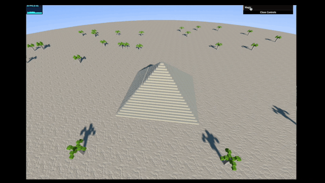

# Cubes - The Magic Pyramid

This repository constains the project developed by Francesco Bombassei De Bona and Andrea Cantarutti (A.A. 2020/2021) and based on the first assignment of the Interactive 3D Graphics course. 

## Description

The project consists of a three.js scene built with cubes only, that contains a pyramid surrounded by some palm trees in the desert. 
The user is able to interact with the scene by moving the camera wherever he wants and by opening the pyramid with the provided GUI input button. 
Opening the pyramid gives the user access to the Pharaoh grave and causes the trees to start levitating until the pyramid closes back. 

## Project structure

### Files
The project directory consists of the following files: 

* **imgs** (directory containing all the images used in markdown reports)

* **libs** (directory containing all the libraries used)
    - **dat.gui.min.js** (which provides GUI interaction tools)
    - **BufferGeometryUtils.js** (which provides utils to optimize geometry stage of the GPUS's pipeline)
    - **stats.min.js** (which provides a tool that display useful info in the upper left corner of the page)
    - **three.min.js** (three.js library)
    - **OrbitControls.js** (which provides tools for controlling camera with input devices)
    - **Coordinates.js** (which allows to draw axes for debugging purposes)

* **textures** (directory containing all the textures used in the scene)

* **journal** (A markdown journal that contains a detailed log of the project realization from start to end)

* **project.html** (Main three.js scene)

* **movie.html** (Alternative version of the same scene with Orbiting and Interaction controls disabled that allows the user to play a short movie, as requestes in the project assignment)

### Textures
All the textures used have been downlaoded from [CC0Textures](https://cc0textures.com/) and [textures.com](http://www.textures.com/).
We made sure that all the textures can be used freely for **personal purposes**:

* **CC0Textures** are licensed under [Creative Commons CC0 License](https://creativecommons.org/publicdomain/zero/1.0/deed.it)

* **textures** provides a new registered user with 12 free credits to download textures. Those are intended for personal usage and can be freely integrated in personal project according to the 6th article of their [Terms of Use](https://www.textures.com/terms-of-use.html).

## A short movie

We decided to choose the second option provided by the assignment and create a short movie. 

To do that, we built another version of our scene that doesn't allow the user to control the camera, but only to start the whole camera animation. 

We, then, captured the whole scene's camera animation through QuickTime player and applied some editing in Final Cut Pro X. We also made a simple soundtrack to improve the overall result. 

More informations about the process have been reported in the **journal markdown file**. 

You can directly download the video and/or audio from the following links:
* [Video](https://cantarutti-bombassei-3dgraphics.s3-eu-west-1.amazonaws.com/video.mov)
* [Audio](https://cantarutti-bombassei-3dgraphics.s3-eu-west-1.amazonaws.com/interactive.wav)

If you just want to take a quick look at the result you can <a href="https://youtu.be/NO5eCB_IUVA" target="_blank">watch it on YouTube</a>.

## Building the scene

The scene was created with BoxBufferGeometries only, most of them later merged to a single geometry for optimization purposes using the **BufferGeometryUtils** library. 

Then, we applied lights in order to simulate the sun light for the outside of the pyramid and the light of a torch for the inside of the pyramid. We also included shaders in orderd to make the doom look as similar to the sky as possibile.

We mainly used **Object3D nodes** and **matrixes** to make all the animations possible and then linked the controls to a **dat.gui interface** in order to let the user interact with them. 

For the movie scene, we were able to lock the framerate at 30fps, to make the whole scene run the same on every monitor.

A detailed description of the whole building process is though provided in the **journal** file of this repository. 

## Follow-up

We are happy about the result so far, but our goal is to improve the overall implementation to reduce complexity and improve performances even on poor machines.

We are also going to implement camera animations with [tween.js](https://github.com/tweenjs/tween.js/) in order to make them look smoother and build a "less naive" camera animation.
