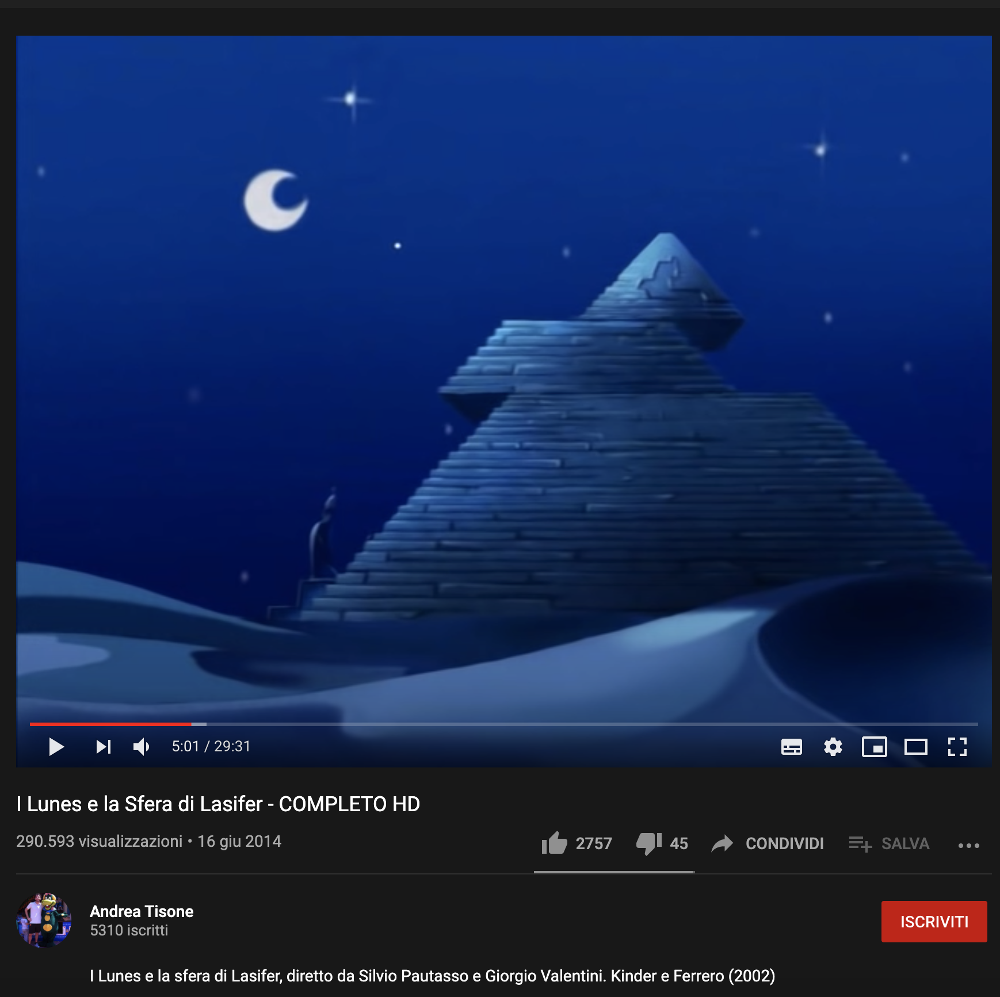
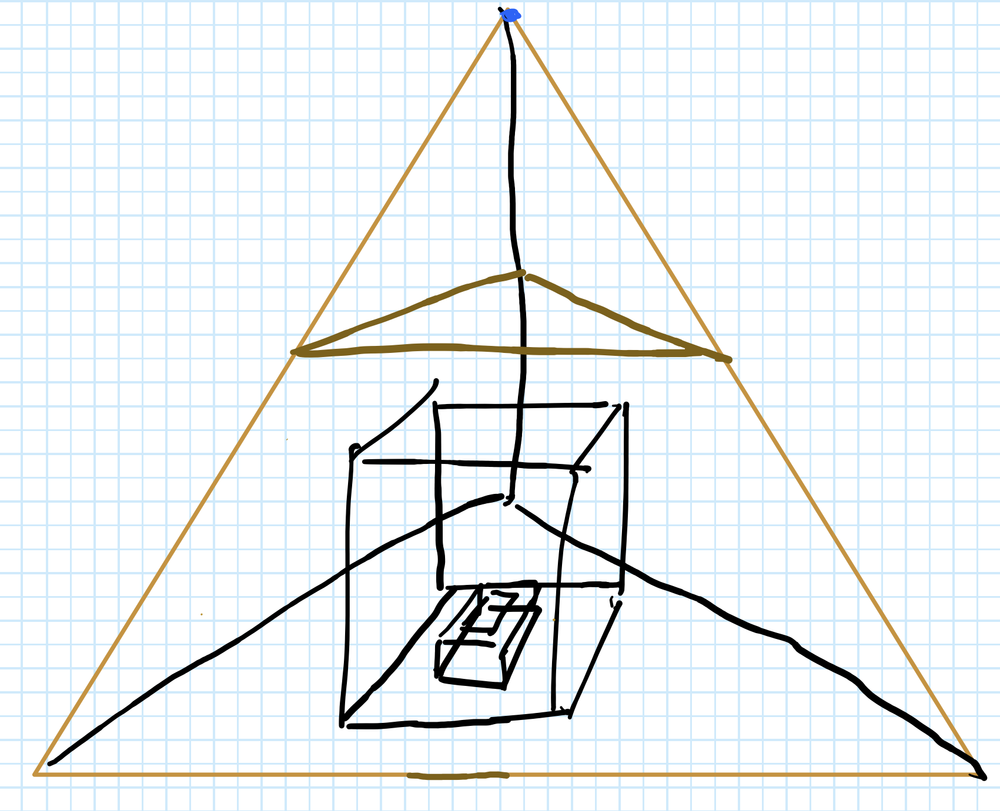
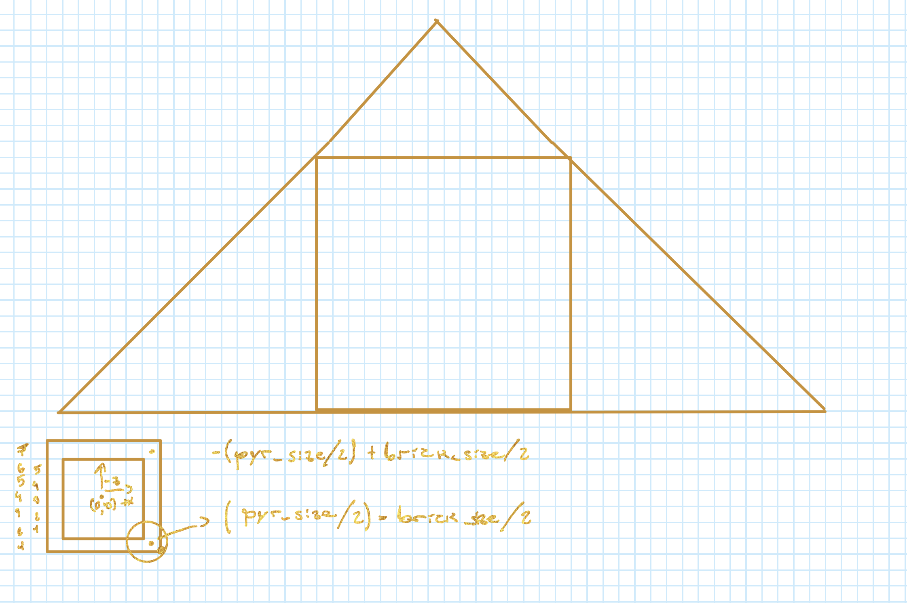
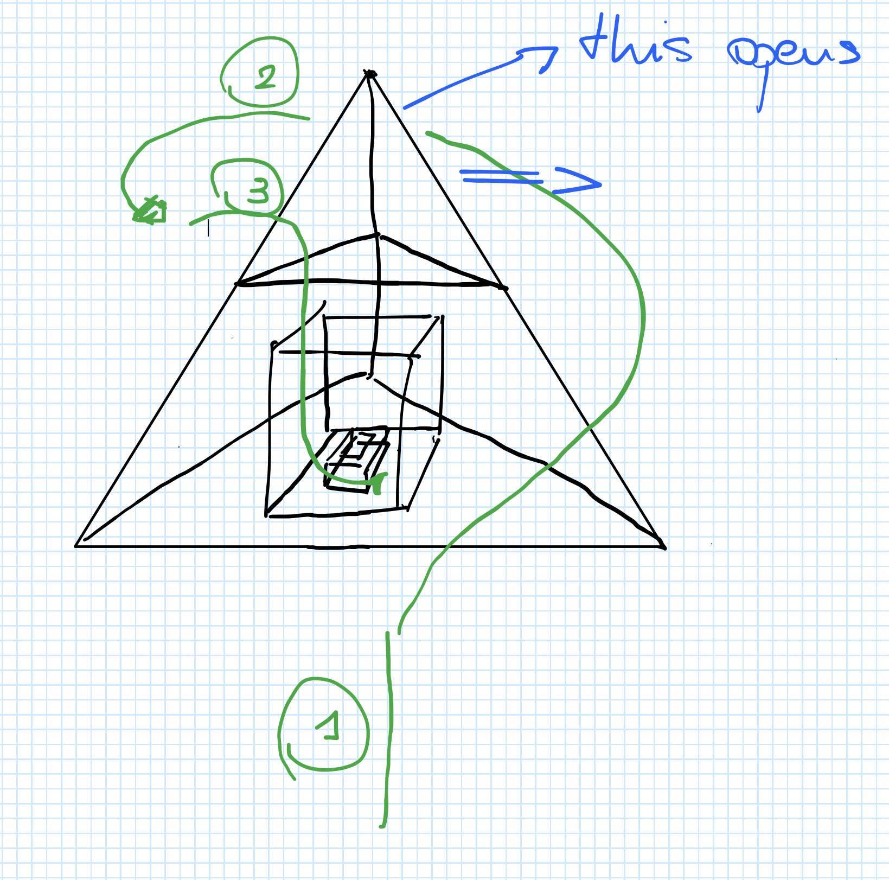
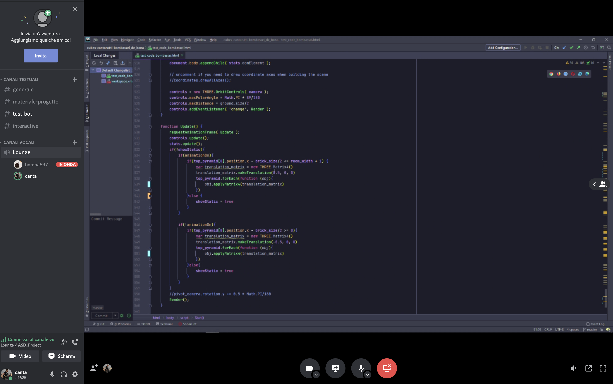
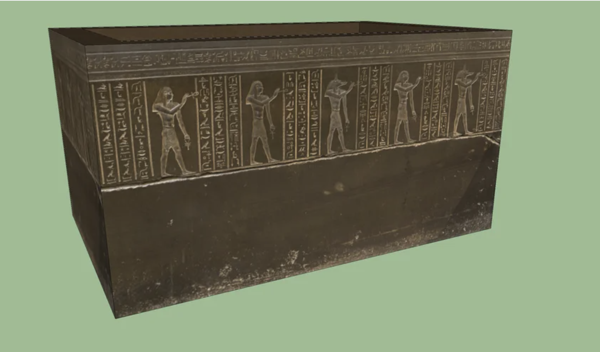
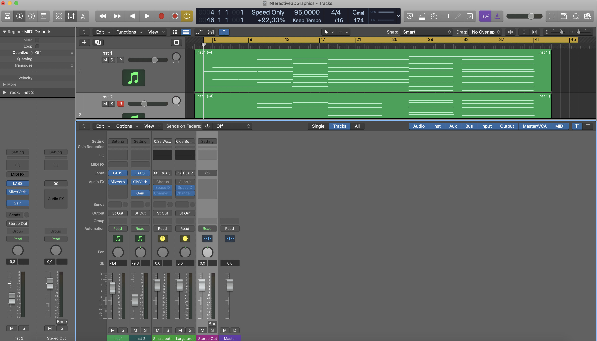
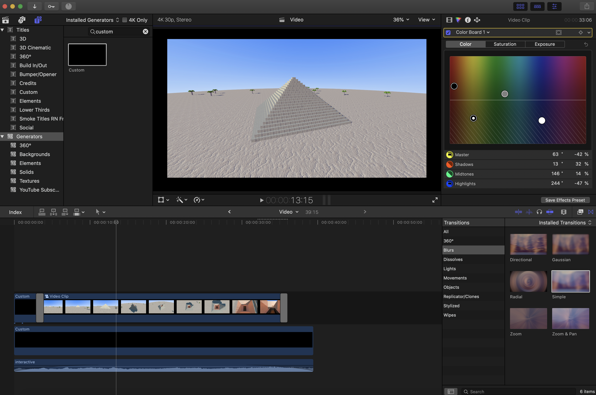

# Interactive 3D Graphics - First assignment - Journal

The aim of this journal is documenting the whole process that lead us to the realization of the whole Interactive 3D Graphics first assignment. s

## Before getting started

We've been tight for time since the beginning, this course is an elective for both of us and we struggled a lot to find some time to realise the whole project. We decided, by the way, to take time during a weekend and try to realise something simple, intereseting and good.

We have a lot of ideas, but none of them seemed to convince us both. We experimented for a few hours with lights, cubes and buildings and then we found an interesting idea to base our project on.

## The main idea
The main ispiration comes from a funny short cartoon we used to watch when we were kids, distributed by Ferrero, which was called "I Lunes e la Sfera di Lasifer". In this little movie, a group of strange characters lives in a pyramid that opens itself like a draw when people that live inside it have to go out. 

We decided we could build a pyramid made of cubes, with a little "phraohn grave" inside, that opens itself in an interesting way, making the whole sarcophagus visible.

The specific scene of the movie we are referring to is the following:  

We are however going to implement the animation in a different (but similar way) to allow the user ot see the grave inside the pyramid.

We are drawing now a few sketches first, using a shared note from Microsoft's One Note software. We designed:
* The whole scheme of the pyramid
* A projection that will help us with measures
* A scheme that describes the camera movement in the movie.

Here's the main sketch:
 

And here's the measures sketch:
 

This is, instead, the camera scheme:
  

## Building

We are working in two ways that both suit our needs. 
We're both parellilizing our work and/or working together with screen sharing while one of us writes the code when we need to focus together on the same thing.

 

We realized the whole grave and the pyramid separately and then **merged** everything together in a single script. 
We applied a lot of interesting textures to out blocks in order to make them look fancy enough. 

We found two interesting websites, which are [CC0Textures](https://cc0textures.com/) and [textures.com](http://www.textures.com/) in which we could find all the texures we need for both the outside and inside of the pyramid. Particularly, on textures.com we found some interesting Egyptian style textures for the grave, while on CC0Textures we found all we needed for materials & co. 

We made sure that all the textures' licenses allows us their use for **personal projects**:

* [CC0Textures](https://cc0textures.com/) are licensed under [Creative Commons CC0 License](https://creativecommons.org/publicdomain/zero/1.0/deed.it)

* [textures.com](http://www.textures.com/) provides a new registered user with 12 free credits to download textues. Those are intended for personal usage and can be freely integrated in personal project according to the 6th article of their [Terms of Use](https://www.textures.com/terms-of-use.html).

The sarcophagus was heavily inspired by [this sketchup model](https://3dwarehouse.sketchup.com/model/0409280f-18e5-4248-b599-aa3bf7ea3ac3/Egyptian-Dark-Sarcophagus?hl=it) found on Sketchup's [3D Warehouse](https://3dwarehouse.sketchup.com/) website.

 

For the torch that lights up the inner grave we are heavily inspired by the iconic minecraft's torch:

## Lights and dome

After completing the building, we are focusing on light in order to make everything look as realistic as possible. We are using a Directional and an Emissive light in order to simulate the sunlight, while we are using a Point light to build the pyramid's inner lightning. 

We based on a [three.js lightning example](https://threejs.org/examples/?q=emisphe#webgl_lights_hemisphere) from which we took inspiration for the outside lightning. We also imported the shaders used in the example to build our dome making it look as similar to the sky as possibile.

## Animation 

After the whole lightning is completed, we are now focusing on programming an interesting animation to open the pyramid. As we decided previously, we don't want it to look execatly like the movie, but we want the top of the pyramid to move in order to let the user look inside the pyramid.

After messing with **nodes** a bit, with found a cool way to open the pyramid the way we wanted to to.

## Assigning animation to dat.gui 

We decided to assign the animation to a button and we read on the initial "readme.txt" that the library dat.gui is what we need to do that. 
Aftering checking the library documentation and a few three.js examples, we figured out how to implement dat.gui functionalities. 

We assigned the control of the animation to a button that allows the user to both open and close the pyramid even if the opening/closing is not yet completed. We are so far happy of the overall result.

## Optimization

We are now observing that the whole scene is quite heavy and FPS dropped, so we might need to optimize a few things.
On an **NVidia RTX 2060** with a 140Hz update frequency FULL HD monitor, the whole scene (on Chrome, with all the accelerations enabled) isn't running as smooth as we want to. 

We observed the same result by running the scene on a MacBook Pro 16" 2019 (with a 60Hz update frequency 2K monitor on Chrome with all the accelerations enabled). Particularly, the MacBook Pro wasn't really smooth when running on its AMD Radeon Pro 5500M 4 GB and was completely laggy when running on the intergated Intel Graphics Card.

We read an interesting [article about optimization](https://codeburst.io/improve-your-threejs-performances-with-buffergeometryutils-8f97c072c14b) on [Codeburst](https://codeburst.io/) and we decided to implement the usage of **mergeBufferGeometries** from **BufferGeometryUtils**. We downloaded the library and incuded in our scripts. This allows to merge all the geometries and send them only once to the GPU insted of having to send every geometry separatly which causes a computational overload. 

However, applying this modification is not as easy as we expected to. We have to build the static truncated pyramid first, and then we have to build the rest of the pyramid (which is the part that will be objected by the animation) separately. While doing that, we have to store all the geometries in arrays insted of adding them to the node. We will later marge all of them and add everything to the scene only once as a single geometry. 

After applying this modification, we observed a great improvement in performances which now are as smooth as we wanted to since the beginning. 

## General improvements and making a short movie

We are now parallelizing our work in order to work simultaneously on adding some new easy elements in order to make the overall scene look a bit more interesting (for now we only had the pyramid) and on making a short movie as requested in the assignement. 

We decided to add some palm trees in our scene.

In order to implement the camera movement we are using **three.js built-in clock** and **nodes**. Later on, we are going to screen capture the whole animation and then make some quick editing on Final Cut Pro X.

We are probably going to provide **two html files**:

* One provided with OrbitControls and GUI menu that lets the user interact with the scene according to his preferences
* The other one with controls and GUI excluded that displays the whole movie (with programmed camera movements).

We encountered a frame-rate issue while building the short movies. Even though we are using a clock function that triggers camera motions according to seconds, the updating of camera's position still depends on how many times the update function is requested in a second. 

We were able to solve this issue by using a **setTimeout** in the Update function, which allowed us to set a standard frame-rate for the animation (30 fps, which gives the cinematic feel that we were looking for). This approach was suggested on [this stackoverflow thread](https://stackoverflow.com/questions/11285065/limiting-framerate-in-three-js-to-increase-performance-requestanimationframe).

## New animations

We decided to add some new animations to make things a bit more magical. When the piramyd opens giving you access to the phraoh grave, all the trees added previously will start **levitating** and **rotating**. 
Moreover, the main light source will start moving on its Z axis.

## Merging all the work

We are now stashing and merging modifications done in order to update the whole repo. We build two files: 

* project.html allows you to interact with the scene
* movie.html allows you to start the movie (wait for the scene to be fully loaded first)

## Video

We are now going to screen capture the movie html file and then build a short video with some color correction applied in FCPX. 

The video will be added to the repository too. 

## A soundtrack

We searched for a soundtrack that matches the video in the way we want to, but we couldn't find one that we could use. So we decided the **compose one**. 

 
We made a two chord progression with a pair of virtual instruments (strings enseble and choir) in Logic Pro X and then exported the track. 

  

Then, we edited the video in Final Cut Pro X and applied some basic editing and some color correction. 

The result will be avaiable in our repository's path.

